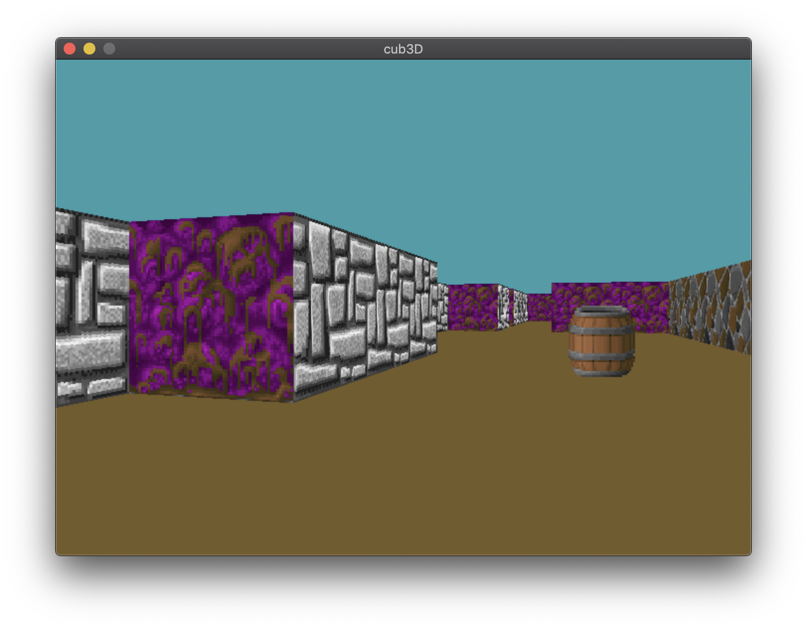

# cub3D

This project makes us familiar with raycasting game engine technique

* Run ``make``
* Run ``./cub3D maps/map.cub`` (unfortunately, current type of libs availiable only for macOS)
* Run ``./cub3d maps/map.cub --save`` to make screenshot from current player position

  

